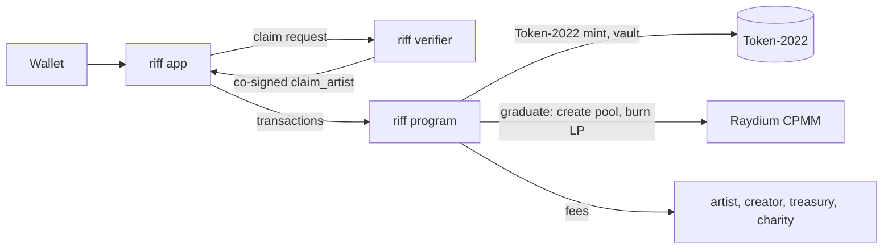

# riff

The Solana program behind riff: community coins for music. Anyone can launch
a coin for an artist; it trades on a bonding curve, a share of every trade
goes to the artist, and once the curve sells out the coin moves to a locked
Raydium pool.

> riff is live on **devnet** only. It is not on mainnet and has not launched a
> token. Official launches are only announced by [@useRiffPad](https://x.com/useRiffPad).

This repository holds the on-chain program only. The app and other
off-chain services live elsewhere.

## Try it

**Live demo: https://riff-gold-nu.vercel.app** (devnet, free test SOL).

1. Set your wallet (Phantom, Solflare, ...) to devnet and get test SOL at
   https://faucet.solana.com.
2. **Explore** coins. Each coin's page shows its market cap, liquidity, 24h
   volume, all-time high, what it has raised for its artist, and whether the
   artist stands behind it ("unclaimed · not endorsed by the artist" until
   they claim it).
3. **Trade** on a coin's curve: a quote before you sign and a slippage limit.
4. **Launch** a coin for an artist, with an image and an optional capped
   launch buy.
5. **Claim** a coin as its artist. A demo verifier stands in for riff's
   real artist verification on devnet.
6. **Graduate** a sold-out coin into Raydium, then trade it there.

On devnet the curve is 100 times cheaper than on mainnet, so a coin sells out
with about 0.85 SOL.

## Architecture



- **riff program** (this repository): coins, the bonding curve, fees, the
  artist claim and graduation. Everything that holds or moves funds.
- **App** (private repository): a web app that reads the program's accounts
  directly and builds transactions from the published IDL. No indexer.
- **Verifier** (private): the only off-chain signer the program trusts. It
  co-signs `claim_artist` once an artist has proved who they are. It can only
  link an unclaimed coin to a wallet; it can't touch curve SOL, other fees or
  claimed coins.

## Deployments

| Cluster | Program | Config | Status |
|---|---|---|---|
| devnet | `59MehWKuM1t6u3LAD4nyEg3kBw1HKq5EbS4ByKsosqtV` | `96rEETSfoVcoUVjtBffBhjutmyynSrRfgDfjC3X7P4hK` | live, for testing |
| mainnet-beta | — | — | not deployed |

[`deployments.json`](deployments.json) has the details: build settings,
Raydium addresses and authorities. Before trusting an address, check that the
program deployed there matches a build of this source.

## How a coin works

1. **Launch.** `create_coin` makes a Token-2022 mint with a fixed supply of
   1,000,000,000 (6 decimals), puts every token in a program-owned vault and
   revokes the mint and freeze authorities. The artist is stored as an ID
   and a name, unverified until the artist claims the coin. The creator may
   buy up to 3% of the supply in the same transaction; nobody else can buy
   until the next slot.
2. **Trading.** `buy` and `sell` trade against a constant-product bonding
   curve over virtual reserves for the first 793.1M tokens. Every trade pays a
   1% fee: 0.5% to the artist, 0.2% to the coin's creator, 0.3% to riff.
   Fees stay on the coin account until collected.
3. **Artist claim.** An artist who proves who they are to riff's verifier
   claims the coin with `claim_artist` (co-signed by the verifier) and
   withdraws their fees with `withdraw_artist_fees`. Until then their share
   is held for them; if the claim window passes unclaimed, it goes to a music
   charity wallet (`sweep_charity_fees`) until they do claim.
4. **Graduation.** When the curve sells out, anyone can call
   `prepare_graduation` and `graduate`. The curve's SOL and the remaining
   206.9M tokens seed a Raydium CPMM pool at the curve's final price, and the
   LP tokens are burned, so the liquidity can never be withdrawn.

## Instructions

| Instruction | Who | What |
|---|---|---|
| `initialize_config` | upgrade authority, once | Fee rates, curve settings, treasury, charity, verifier, Raydium fee tier |
| `update_config` | admin | Change the treasury, charity, verifier, Raydium fee tier or claim window (not the fee rates) |
| `transfer_admin` / `accept_admin` | admin / proposed admin | Two-step admin handover |
| `create_coin` | anyone | Launch a coin, with an optional capped launch buy |
| `buy` / `sell` | anyone | Trade on the curve, with slippage limits |
| `withdraw_creator_fees` | coin creator | Collect the creator's fees |
| `claim_artist` | artist + verifier | Link the coin to the artist's wallet |
| `withdraw_artist_fees` | claimed artist | Collect the artist's fees |
| `sweep_charity_fees` | anyone | Send charity-bound fees to the charity wallet |
| `collect_protocol_fees` | anyone | Send riff's fees to the treasury |
| `prepare_graduation` / `graduate` | anyone | Move a sold-out coin into its Raydium pool |

Every state change emits an event (`CoinCreated`, `Trade`, `ArtistClaimed`,
`Graduated`, ...). The interface is published as an Anchor IDL in
[`idl/`](idl).

## Accounts

| Account | Seeds | Holds |
|---|---|---|
| `Config` | `["config"]` | Admin, treasury, charity, verifier, fee rates, curve settings, Raydium fee tier |
| `Coin` | `["coin", mint]` | Curve reserves, fee balances and running totals; its lamports back every balance |
| Vault | `["vault", mint]` | Token-2022 account with the unsold curve tokens and the graduation reserve |
| Graduation authority | `["graduation", mint]` | System account holding the curve's SOL during graduation |
| Pool address | `["pool", mint]` | Signs the Raydium pool's creation, so nobody can create it first |

## Design notes

1. **Fixed supply, no authorities.** Mint and freeze authority are revoked at
   launch; nothing can mint more or freeze a holder.
2. **No sniping the launch.** Only the creator's capped buy happens in the
   launch slot; `buy` opens the slot after.
3. **The pool opens at the curve's last price.** The starting virtual token
   reserve is derived from the curve and graduation sizes, so graduating
   doesn't move the price.
4. **Solvency is checked on every payout.** All SOL leaves a coin through one
   function that re-checks the coin still holds rent plus everything it owes.
5. **Rounding favours the curve.** Quotes round against the trader, so the
   curve can always repay every circulating token.
6. **Graduation can't be blocked or front-run.** The pool address is a riff
   PDA, graduation ignores tokens or SOL donated to its accounts, and it is
   split in two instructions because the live SPL Token program rejects
   the single-instruction version.
7. **Fixed rules for the artist's share.** It is held for the artist, paid to
   the claimed artist, or swept to the charity wallet in the config. No
   instruction sends it anywhere else.
8. **Running totals on chain.** Each coin records every artist share ever
   paid, its peak price and hourly volume for the last 24 hours, so apps
   don't need an indexer for them.

## Security

- The admin can't change fee rates, touch curve SOL, or reach the fees held
  for artists and creators. It can change the treasury and charity wallets
  and the verifier, so it is meant to be a Squads multisig. So is the
  upgrade authority, which can replace the program.
- Tests run against the SPL Token, Token-2022 and Raydium CPMM programs as
  deployed on mainnet (`programs/riff/tests/fixtures/`), not mocks.
- CI builds, tests, runs clippy, `cargo audit` and gitleaks on every change,
  and checks that `idl/` and `vectors/` match the program.
- An internal security review found three issues that are fixed, each with
  regression tests: graduation into a DEX (H-01), the artist claim and
  charity flow (M-01), and launch-slot bundling around the creator-buy cap
  (M-02).
- Not yet audited externally. See [`docs/AUDIT_PACKAGE.md`](docs/AUDIT_PACKAGE.md)
  for scope, invariants and known limitations.

Found a vulnerability? Please report it privately; see [SECURITY.md](SECURITY.md).

## Status and roadmap

**Now:** live on devnet, with the full lifecycle (launch, trade, claim,
charity, graduation, trading on Raydium) working end to end in the app.

**Before mainnet:**

- an external security audit;
- admin and upgrade authority moved to a Squads multisig with a time lock;
- real artist verification (Spotify for Artists plus manual review) behind
  the verifier;
- an emergency pause, and a way to undo a fraudulent claim;
- keeping the artist's cut after graduation;
- verifiable builds, and the move to SBPF v3 before Solana stops accepting v0
  deployments.

riff has not launched a token. Mainnet is announced only by
[@useRiffPad](https://x.com/useRiffPad).

## Build and test

Linux or WSL2, with Rust (pinned by `rust-toolchain.toml`), Agave/Solana
CLI 4.1.2 and Anchor CLI 1.2.0:

```bash
make build         # anchor build --arch v0 (SBPF v0, mainnet addresses)
make build-devnet  # devnet build (Raydium's devnet addresses)
make test          # build, then all tests on LiteSVM; no validator needed
make lint
```

## Repository layout

```
programs/riff/src/             the program
programs/riff/tests/           integration tests (LiteSVM)
programs/riff/tests/fixtures/  mainnet program and account snapshots
idl/                           Anchor IDL and TypeScript types (generated)
vectors/curve.json             curve-math test vectors (generated)
deployments.json               where riff is deployed and how it was built
docs/AUDIT_PACKAGE.md          for auditors
```

## Published files

- `idl/riff.json`, `idl/riff.ts`: the program's interface, from `make idl`.
- `vectors/curve.json`: thousands of buy, sell and fee-split cases computed by
  the program's own math, from `make vectors`. Any off-chain port of the
  curve should reproduce them exactly.
- `deployments.json`: program IDs, config addresses and build settings.

## License

Proprietary. All rights reserved, © 2026 riff. The source is public so anyone
can verify what the program does; see [LICENSE](LICENSE).
